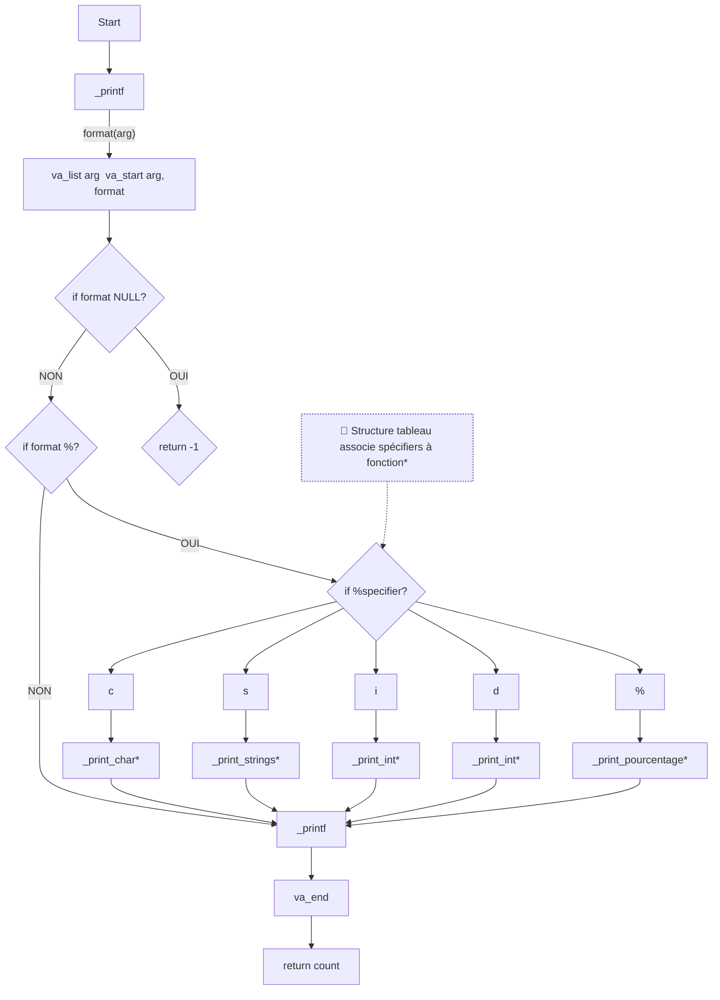

# holbertonschool-printf
# C - printf
** `#0969DA` Cette  fonction produit une sortie selon le format rencontré. Notre fonction printf, engloble toute les fonctions pour traiter chaque cas de format rencontre (si la valeur donné est un entier, chaîne de caractère, caractère, etc...) **

## Commande qui permet la compilation :
gcc -Wall -Wextra -Werror -pedantic -std=gnu89 -Wno-format *.c
	- gcc : est utiliser pour compiler notre code
Le code respecte le standard C89 et tous les avertissements lors de la compilation sont activés (si toutes les erreurs ne sont pas corrigés, alors la compilation ne fonctionnera pas) en compilant tous les fichiers qui se finissent par .c (cela évite de mettre tous les fichiers un par un dans notre gcc)

## Exigences :
	- Allowed editors: vi, vim, emacs
	- Tous les fichiers sont compilé sur Ubuntu 20.04 LTS
	- Le code utilise le style Betty
	- Notre structure, ainsi que les prototypes de toutes les fonctions sont inclus dans le main.h.

## Flowchart :

### Exemple d'utilisation de la fonction _printf(code ou screenshots) avec le résultat en STDOUT

### Man Page (commande d'exécution de la man page)

5) Exemples
	5.1/ _printf("Negative:[%d]\n", -762534); --> retourne -762534
	5.2/ _printf("%c%cth %s%s a%cg%s: Y%sou %s no%ching%s Snow.%c", 'W', 'i', "some ", "more", 'r', "s", "", "know", 't', ", Jon", '\n'); --> With some more args: You know nothing, Jon snow.
	5.3/ _printf("Percent:[%%]\n"); --> %
	5.4/ thought = _printf("Hello Samourai\n"); --> Hello Samourai
	5.5/ _printf("Length:%d\n", thought); --> Lenght:15

6) Failles mémoire détectés ?
On détecte une fuite de mémoire avec l'utilisation de Valgrind, un outil notamment utile pour mettre en évidence des potentiels fuite de mémoire.

	- Valgrind ./a.out ! = total heap usage : allocs, frees, 1,024 bytes allocated
	Après l'utilisation de Valgrind l'on peut voir que nous n'avons pas de fuite mémoire car notre allocation mémoire statique retiens bien une valeur retour (on retourne bien le nombre total de caractère imprimé et on ferme bien notre déclaration argument variadique par un va_end)

6) Flowchart

